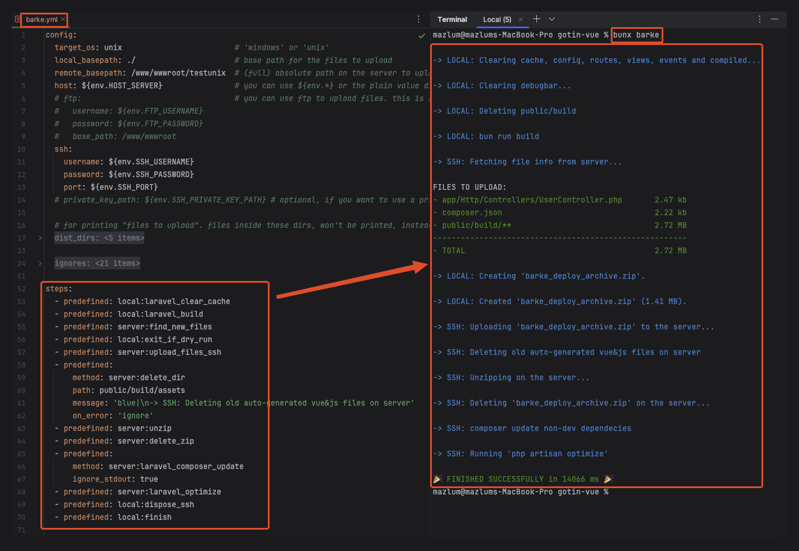
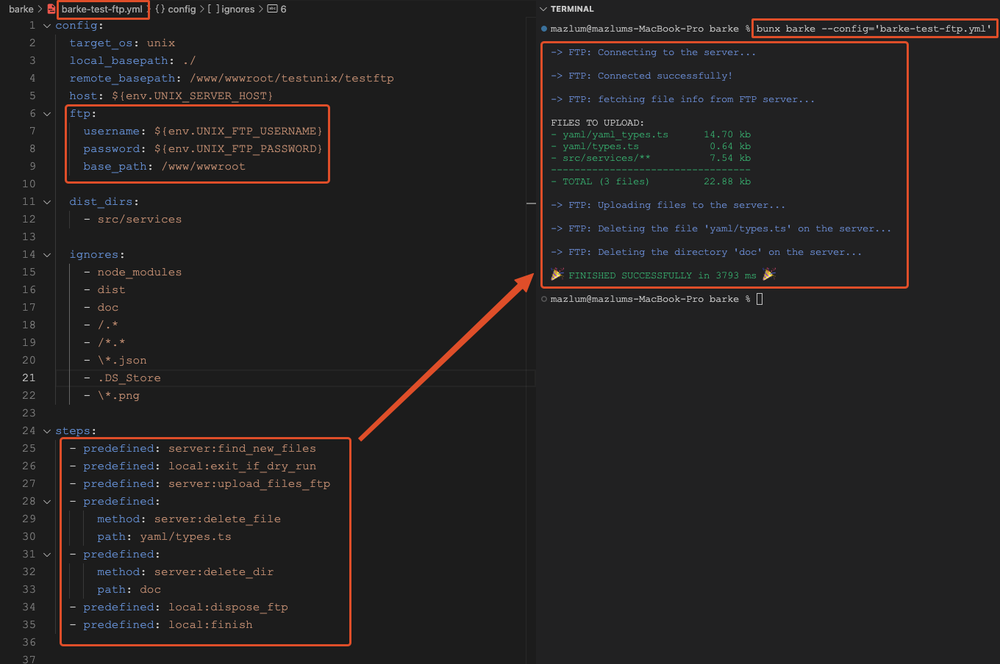

[](https://www.npmjs.com/package/@mergehez/barke)


# Barke

An automation utilities library and cli tool.

I built it for myself but now we are using it in our company as well. It is usefull for deployment. It has some predefined methods like "findNewFiles". This example method finds files inside your remote folder, compares them with the local ones and gives you a list of modified files. You can then use the predefined method "uploadFiles" to upload this files to the server. 

For all available predefined methods check the code.

The library also has a cli command: "barke", which parses your barke.yml file and executes the steps defined in it. see the example: [barke.laravel.yml](./yaml/barke.laravel.yml)
You can run `npx barke` in the directory where yout barke.yml file is. The script will run from that directory. Or you can specify the config file using the '--config' argument like this: `npx barke --config='barke.prod.yml'`


# Installation
```bash
bun i -g @mergehez/barke
```
*or with any other package manager like 'npm'*:
```bash
npm i -g @mergehez/barke
```

# CLI usage
```bash
bunx barke
```
*or with any other package runner like 'npx'*:
```bash
npx barke
```

When running `barke` without arguments, it looks for the config file named `barke.yml`. If you want to execute it using another config file, you can use the `--config` argument. This is useful for separating deployments to your staging and production enviroments.

```bash
bunx barke --config='barke.staging.yml'
```

## Examples

This one is using SSH and some built-in laravel methods


This one uses FTP to deploy the site. Maybe they don't have SSH-Access, but FTP...


# Library usage (Example)

```typescript
import { useExecuter } from "./src/index.ts";

const executer = useExecuter({
    targetOS: 'windows',
    sourceBasePath: './bin/publish',
    targetBasePath: 'C:/inetpub/wwwroot/mysite',
});

const sshConn = await executer.sshConnect({
    host: process.env.WIN_SERVER_HOST,
    username: process.env.WIN_SSH_USERNAME,
    password: process.env.WIN_SSH_PASSWORD,
    port: parseInt(process.env.WIN_SSH_PORT),
});
const iis = executer.useIISHelpers(sshConn);

// STEPS:
executer.exec({
    command: 'dotnet publish -c Staging -r win-x86 -f net9.0 -o "./bin/publish"',
    message: 'Building project...',
})
const newFiles = await sshConn.findNewFiles({
    ignorePatterns: [
        '/toIgnore',
        '*.txt',
    ],
    ignoreFn: (path, stats) => {
        return !stats.isDirectory() && !path.includes('/');
    }
});

const zip = executer.compressFiles(newFiles, [
    'MailTemplates', // print like 'MailTemplates/**'
]);

await sshConn.uploadFile(zip.path);
iis.stopSite('mysite', 'mysite');
await zip.unzipOnServer(sshConn);
await zip.deleteOnServer(sshConn);
iis.startSite('mysite', 'mysite');
zip.deleteLocally();

sshConn.dispose();
executer.finish();
```

